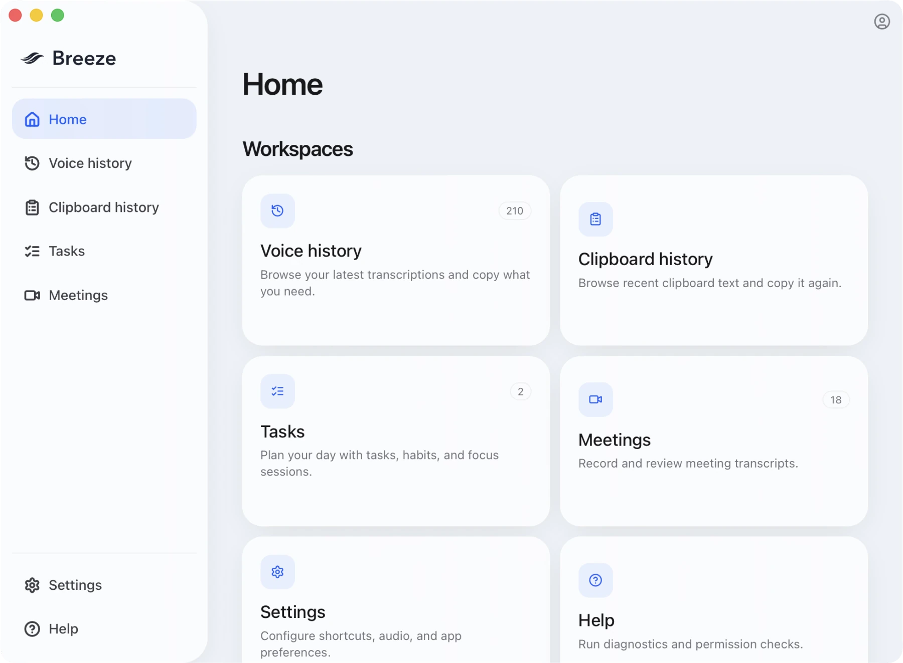
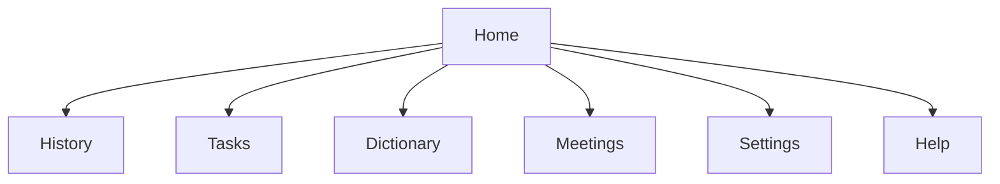
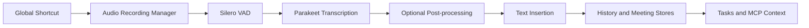

<p align="center">
  
</p>

<h1 align="center">BreezeType</h1>
<p align="center"><strong>Local-first desktop dictation with a full voice workspace.</strong></p>

<p align="center">
  <a href="https://discord.gg/Rfuvm7Pd2G"></a>
  <a href="https://x.com/sciguy"></a>
  <a href="https://youtube.com/keystonescience"></a>
</p>

<p align="center">
  <a href="#quick-start-build-from-source">Quick Start</a> •
  <a href="#feature-tour">Feature Tour</a> •
  <a href="#open-source-boundary">Open Source Boundary</a> •
  <a href="#github-presentation-assets">Assets</a> •
  <a href="#agent-runbook">Agent Runbook</a> •
  <a href="#troubleshooting">Troubleshooting</a>
</p>

<p align="center">
  
  
  
  
  
</p>

BreezeType is a cross-platform Tauri desktop app for voice-driven work.

It starts as a fast dictation tool and extends into a workspace with history, meetings, tasks, dictionary corrections, and a hidden local MCP surface for model access to that context. Transcription is local-first and powered by Parakeet models running on-device.

This repository is the desktop app. BreezeType account, sync, sharing, billing, and team features intentionally call BreezeType's managed hosted API when a signed-in user enables those flows. The local dictation, meeting capture, history, tasks, dictionary, and MCP surfaces remain local-first.

<p align="center">
  
</p>

## Install

- Latest release artifacts (public): [KeystoneScience/breeze-releases](https://github.com/KeystoneScience/breeze-releases/releases/latest)
- Building from source: see the quick start below

The public releases repo is the distribution channel for signed installers and Tauri updater metadata. This source repo is the desktop client codebase.

## Why BreezeType

- Local-first transcription by default (Parakeet V3)
- Global shortcuts for capture and clipboard history
- Strong insertion controls for real-world app compatibility
- Built-in meeting recorder with transcript, notes, summary, and task extraction
- Built-in task workspace (planning, habits, focus timer, smart filters)
- Optional transcript cleanup with local llama.cpp or external LLM providers
- Pro account, sync, and sharing flows that call BreezeType's hosted server only when used

## Open Source Boundary

This is the same BreezeType desktop app that users install. It is not a stripped-down community fork, and Pro workflows should keep using the same managed BreezeType service as the distributed app.

The public App repo contains the local desktop experience: dictation, meeting capture, local history, tasks, dictionary corrections, local MCP context, and provider integrations. The private website and server repos remain outside this tree.

Contributors do not need private server credentials for local development. If you sign in or use an account, Pro, sync, hosted sharing, support, or telemetry workflow, that request goes to the managed BreezeType API at `https://api.breezetype.com`.

Please preserve that boundary: do not commit private API credentials, release signing material, local user data, or alternate server assumptions unless the change is explicitly scoped to that work.

Open-source/local builds should not require a BreezeType account to reach the app. Official production builds can opt into first-run auth with `VITE_BREEZE_REQUIRE_FIRST_RUN_AUTH=true`; otherwise account sign-in stays available from the top-right profile menu when hosted features are used.

## Feature Tour

| Area            | What it does                                                                                                                              |
| --------------- | ----------------------------------------------------------------------------------------------------------------------------------------- |
| Dictation       | Global shortcut capture, push-to-talk, optional Fn/Globe support (macOS), audio feedback, overlay, clipboard fallback                     |
| Transcription   | Local Parakeet V3 (`parakeet-tdt-0.6b-v3`) with in-app download and switching                                                             |
| Insertion       | `Direct`, `Ctrl/Cmd+V`, `Ctrl+Shift+V`, `Shift+Insert`, or clipboard-only behavior depending on settings/platform                         |
| History         | Searchable transcript history, source-app context, stats, saved entries, audio playback, local recording retention controls               |
| Dictionary      | Custom term dictionary and correction flow for domain-specific vocabulary                                                                 |
| Meetings        | Record meetings, live transcript, timestamped notes, participant management, summaries, generated follow-up tasks, exports                |
| Tasks           | Local task + habit manager with due dates, priorities, recurrence, smart filters, matrix/planner views, focus timer                       |
| MCP             | Hidden read-only local MCP server for tasks, clipboard history, transcription history, and meeting data                                   |
| Post-processing | Optional transcript cleanup using local llama.cpp, OpenAI, OpenAI Codex OAuth, OpenRouter, Anthropic, Groq, Cerebras, or custom endpoints |
| UX              | Tray app, single-instance behavior, themes, and 10 UI locales (`en`, `zh`, `es`, `fr`, `de`, `ja`, `vi`, `pl`, `it`, `ru`)                |

### Workspace Map



## Architecture



## GitHub Presentation Assets

The README header uses the lightweight SVG mark at `src/assets/breeze_mark_square.svg`. Keep durable GitHub-facing screenshots, website-derived hero images, social previews, and demo stills under `.github/assets/` when they are ready to be committed, then reference them from this README or PRs with relative paths.

Do not reference images from `tmp/`, `output/`, local app-data directories, generated release scratch folders, or screenshots that contain transcripts, recordings, provider keys, email addresses, private URLs, or Website/Server admin surfaces.

The current social-preview candidate is `.github/assets/breezetype-github-social.png`; GitHub still needs that image selected in repository settings because the social preview is not auto-read from the repo. It is composed from public Website brand/product assets copied into `.github/assets/`, with `.github/assets/breezetype-social-background.png` kept as the reusable background plate.

The DMG background at `src-tauri/dmg/BreezeTypeDmgBackground.png` is release packaging art, not the GitHub social preview. If you generate or compose new visuals, keep drafts local and move only reviewed, sanitized final assets into `.github/assets/`.

## Quick Start (Build From Source)

### 1) Prerequisites

- [Rust (latest stable)](https://rustup.rs/)
- [Bun](https://bun.sh/)
- [Tauri prerequisites](https://tauri.app/start/prerequisites/)

For platform-specific package lists, see [`BUILD.md`](BUILD.md).

### 2) Install dependencies

```bash
bun install
```

`bun install` now auto-installs Senko diarization dependencies (into `.venv-senko`) if missing.

### 3) Optional environment overrides

Most contributors do not need local environment variables. If you need to point at a staging API or web URL, copy the example and edit your local file:

```bash
cp .env.example .env.local
```

Do not put release signing credentials, provider API keys, or private server secrets in committed files.

### 4) Install required VAD model (required for dev)

```bash
mkdir -p src-tauri/resources/models
curl -L -o src-tauri/resources/models/silero_vad_v4.onnx \
  https://blob.handy.computer/silero_vad_v4.onnx
```

### 5) Run the desktop app

```bash
bun run tauri dev
```

If you hit a CMake policy issue on macOS:

```bash
CMAKE_POLICY_VERSION_MINIMUM=3.5 bun run tauri dev
```

### 6) First launch flow

Release builds bundle the default local models so users do not need a first-run model download. Development builds can prepare the same assets with:

```bash
bun run models:prepare
```

## Daily Dev Commands

| Task                                          | Command                 |
| --------------------------------------------- | ----------------------- |
| Desktop dev (Tauri)                           | `bun run tauri dev`     |
| Frontend-only dev                             | `bun run dev`           |
| Frontend build                                | `bun run build`         |
| Production desktop build                      | `bun run tauri build`   |
| Manually install/repair Senko diarization env | `bun run senko:install` |
| Lint                                          | `bun run lint`          |
| Format all                                    | `bun run format`        |
| Check formatting                              | `bun run format:check`  |

## Default Hotkeys

| Action                   | macOS          | Windows        | Linux          |
| ------------------------ | -------------- | -------------- | -------------- |
| Transcribe               | `option+space` | `shift+tab`    | `shift+tab`    |
| Cancel current operation | `escape`       | `escape`       | `escape`       |
| Clipboard history picker | `cmd+shift+v`  | `ctrl+shift+v` | `ctrl+shift+v` |

## Agent Runbook

If you are a coding agent or reviewer, this is the fastest safe path.

### Bootstrap

```bash
bun install
mkdir -p src-tauri/resources/models
test -f src-tauri/resources/models/silero_vad_v4.onnx || \
  curl -L -o src-tauri/resources/models/silero_vad_v4.onnx \
  https://blob.handy.computer/silero_vad_v4.onnx
```

### Smoke checks

```bash
bun run build
bun run lint
cd src-tauri && cargo check
```

### Runtime check

```bash
bun run tauri dev
```

### Files to read first

- `src-tauri/src/lib.rs` (app bootstrap, plugins, command wiring)
- `src-tauri/src/managers/` (audio/model/transcription/history/meetings)
- `src/components/` and `src/stores/` (UI flows + local task state)
- `src/bindings.ts` (generated command surface between frontend and backend)
- `AGENTS.md` (repo-specific operating instructions)

### Important context

- Transcription engine is currently Parakeet-based (not Whisper).
- Some internal names still use `handy_*` from earlier naming.

## Configuration

### Frontend environment variables

| Variable                             | Purpose                                                               | Default                      |
| ------------------------------------ | --------------------------------------------------------------------- | ---------------------------- |
| `VITE_BREEZE_SERVER_URL`             | Auth/sync/API base URL for hosted Pro flows                           | `https://api.breezetype.com` |
| `VITE_BREEZE_WEB_URL`                | Web app/account URL                                                   | `https://breezetype.com`     |
| `VITE_BREEZE_REQUIRE_FIRST_RUN_AUTH` | Set to `true` in official production builds to require first-run auth | unset / `false`              |

Copy `.env.example` to `.env.local` when you need local overrides. Do not commit `.env.local`, signing credentials, provider API keys, or user data.

### Useful runtime env vars

| Variable              | Purpose                                                                        |
| --------------------- | ------------------------------------------------------------------------------ |
| `RUST_LOG`            | Controls Rust-side log verbosity                                               |
| `BREEZE_MCP_MANIFEST` | Optional override for the hidden BreezeType MCP manifest path                  |
| `BREEZE_APP_DATA_DIR` | Optional override for the BreezeType app data directory used by the MCP server |

## Permissions (especially macOS)

BreezeType checks and guides required permissions in-app.

- Required for dictation: Microphone + Accessibility
- Optional/feature-specific: Input Monitoring, Screen Recording
- Meeting recording and any system-level app introspection features may require Full Disk Access

## Data and Privacy

- Local-first by default: transcription and core app data are local
- History and recordings are stored in app-local data (SQLite + files)
- Settings and command snippets are persisted locally via Tauri store files
- Optional features can send data externally (post-processing providers, account, Pro, sync, or sharing endpoints)
- Pro features such as account login, hosted sync, support submissions, telemetry events, and meeting sharing call BreezeType's hosted server.

In-app controls allow retention limits, recording cleanup windows, and provider selection.

## Security

Please report vulnerabilities privately. See [`SECURITY.md`](SECURITY.md).

## Troubleshooting

### App fails to record/transcribe in dev

- Confirm `src-tauri/resources/models/silero_vad_v4.onnx` exists
- Re-run the VAD model download command in quick start

### macOS build fails with CMake policy error

```bash
CMAKE_POLICY_VERSION_MINIMUM=3.5 bun run tauri dev
```

### Shortcut triggers but text does not paste in target app

- Try a different paste method in Settings (`Direct`, `Ctrl/Cmd+V`, etc.)
- Confirm Accessibility permission is granted

### Meeting or MCP-backed context features not fully available

- Verify relevant permissions (screen recording/full disk access on macOS)
- Confirm post-processing provider or local LLM model status in Settings

## Releases and Auto-updates

BreezeType uses Tauri updater artifacts. The public updater endpoint and public verification key are in `src-tauri/tauri.conf.json`; the private updater signing key is not part of this repo.

Anyone can build BreezeType locally from this repository. Official signed installers, notarization, updater signatures, and release publication are maintainer-only because they require private signing credentials and updater key material.

For the public release boundary, see [`docs/release-builds.md`](docs/release-builds.md).

## Repository Map

- `src-tauri/` Rust backend, managers, system integrations
- `src/` React + TypeScript desktop UI
- `src/stores/` client-side state (tasks, auth, settings)
- `scripts/` release/version/support scripts
- `.github/workflows/` CI build and release workflows

## Contributing

- Start with [`CONTRIBUTING.md`](CONTRIBUTING.md)
- Platform setup details: [`BUILD.md`](BUILD.md)
- Agent-oriented instructions: [`AGENTS.md`](AGENTS.md)

## License

MIT. See [`LICENSE`](LICENSE).
